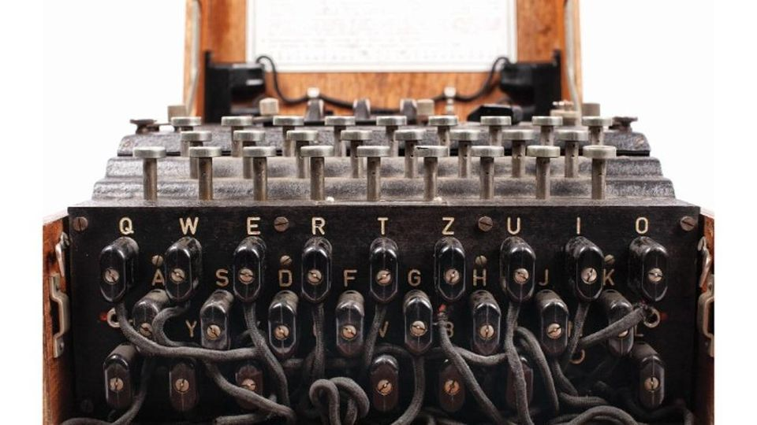

<!---  -->

### 👋 Hi, I'm Alessandro

#### 😄 I'm a 20 y.o. guy form [Rivarone](https://en.wikipedia.org/wiki/Rivarone), [Alessandria](https://en.wikipedia.org/wiki/Alessandria), [Piedmont](https://en.wikipedia.org/wiki/Piedmont), Italy.

#### 🤔 I'm interested in musics, movies and arts. I'm always tries to challenge myself with something new. Currently I'm learning French.

#### 💻 I'm also love tecnology and I've been starting coding since I was 15 y.o.

#### 📍 Now I live in Rome, where I attend at [42RomaLuiss](https://42roma.it/), the BE(A)ST Coding School in the World, fouded in 2021 by [LUISS University](https://en.wikipedia.org/wiki/Libera_Universit%C3%A0_Internazionale_degli_Studi_Sociali_Guido_Carli) and [Riccardo Zacconi](https://en.wikipedia.org/wiki/Riccardo_Zacconi), founder and ex-CEO of [King](https://en.wikipedia.org/wiki/King_(company)). The campus is part of the [42Network](https://42.fr/en/network-42/), started with the opening of the first campus in 2013 in [Paris](https://en.wikipedia.org/wiki/42_(school)), founded by [Xavier Niel](https://en.wikipedia.org/wiki/Xavier_Niel), founder of [Iliad](https://en.wikipedia.org/wiki/Iliad_(company)). Today it count 42 campuses in 25 countries.

#### 📂 In my repos, you'll find my 42project. Feel free to download and try it. If you found errors or have suggestions for something I coded, create an issue insie the repo. If you need help, email me. GLHF👾!

<!-- I'm also working on [my Italian 42Docs site](https://ametta42.github.io/42Docs_IT/) -->
#### 📝 Here's my [Resume](https://github.com/AlessandroMetta/AlessandroMetta/blob/main/CV.pdf)

#### 📈 My stats:
<!--

	

-->

	

	

